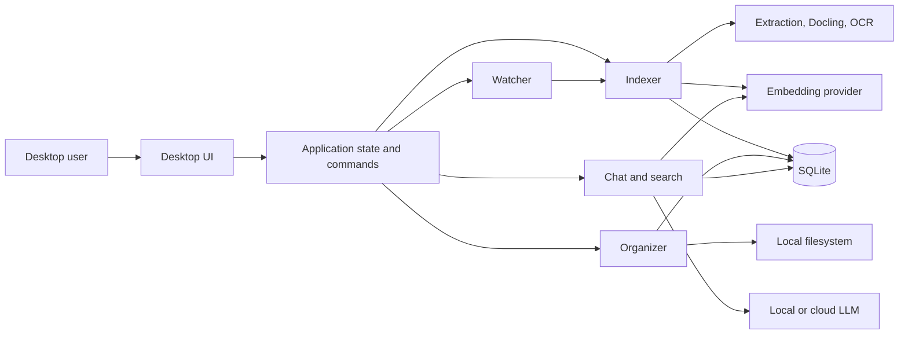
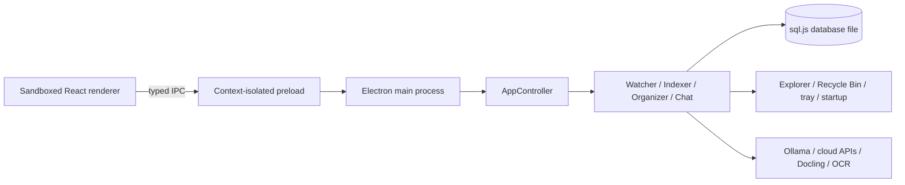
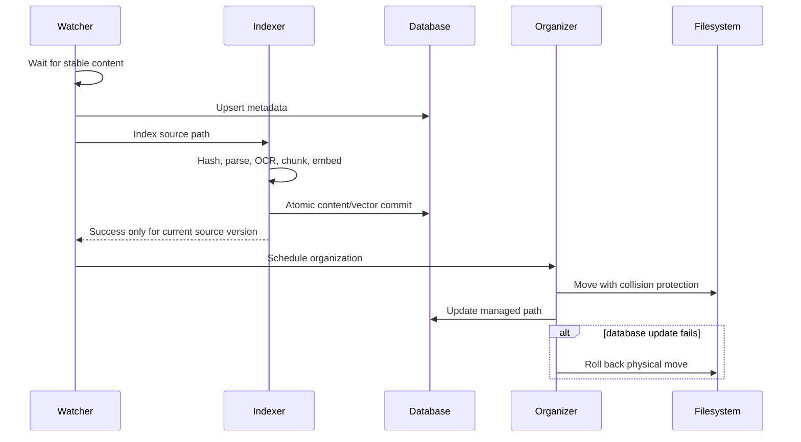

# Technical Architecture

## Runtime structure



## macOS modules

| Layer | Modules | Responsibility |
| --- | --- | --- |
| Application | `FileNestApp`, `AppState`, `AppSettings` | scenes, commands, state, settings, dependency composition |
| UI | `MainView`, `LibraryView`, `ChatView`, `FilePreviewView`, `SettingsView`, `StatisticsView`, `MenuBarView`, `OnboardingView`, `RulesView` | user journeys and native interactions |
| Domain | models, protocols, eligibility and organization policies | portable vocabulary and invariants |
| Services | watcher, indexer, organizer, chat, summaries, model managers, logs, updates | workflow coordination |
| Extraction | native extractors, Docling, OCR processor | content and structured chunks |
| Providers | embedding, LLM, OCR | local/cloud transport adapters |
| Storage | `SQLiteStore`, `AccelerateVectorStore` | durable metadata, chunks, vectors, sessions, usage |

## Windows processes



The renderer has no Node.js access. File previews use an allowlisted custom protocol whose path must already exist in the library database. External navigation is denied or routed to the system browser.

## Important flows

### Long-running UI work

`ChatView` remains mounted inside the main window while Library is selected. Visibility and hit testing change, but the streaming task and composer state stay alive. `AppState` tracks running and completed session identifiers so sidebar rows can show a spinner or unread completion dot without persisting transient UI state. Menu bar index animation uses `TimelineView`, keeping display-only animation frames out of application state.

### Watch, index, then organize



### Retrieval and chat

The query planner combines explicit metadata intent, relative/absolute date intent, direct filename/title/note/path matches, keyword content matches, exact chunk entities, and semantic child matches. Lexical, entity, and semantic ranks are fused with reciprocal-rank fusion; semantic acceptance uses a query-relative score window with a safe floor. An optional OpenAI/Jina-compatible reranker processes the strongest candidates and fails open to fused order. Normal library search is automatic and debounced; Smart Search is an explicit escalation from completed normal results and streams a short interpreted intent while the AI plan is built.

The indexer retains Docling sections as answer-time parents and produces smaller retrieval children. The current defaults are a 600-token parent maximum, a 300-token retrieval target, and up to 80 tokens of semantic overlap. These are soft semantic limits: complete paragraphs and sentences take priority over exact sizing. Source chunks do not receive overlap; overlap is applied once when retrieval children are created, and it repeats complete semantic units. A child match resolves to its parent, table children repeat their header, results are deduplicated by parent, and the answer context is capped at eight parents plus a character budget. File chat bypasses library-wide retrieval. Context planning keeps recent turns, compresses older turns, and bounds retrieval to the selected model context window. Library answers receive stable `[F#:P#]` evidence IDs; a deterministic final pass removes invalid IDs and records citation coverage. See [Semantic chunking and reindexing](11-semantic-chunking-and-reindexing.md) for the boundary rules and rebuild policy.

Every library retrieval writes a bounded local trace containing candidate counts, the effective semantic threshold, reranker identity, result count, and latency. These traces support offline recall and ranking evaluation without adding a chunk-level FTS index.

### Agent Skills runtime

FileNest implements the open Agent Skills package shape: each capability is a directory containing a `SKILL.md` file with YAML frontmatter and Markdown instructions, with optional `agents/openai.yaml` metadata and on-demand resources. The runtime discovers bundled packages, `~/.agents/skills`, and FileNest-managed packages. Name collisions resolve in that order, with managed packages taking precedence.

The runtime follows progressive disclosure. Discovery caches only validated names, descriptions, metadata, and resource manifests. Deterministic capability defaults, explicit `$skill-name` requests, and skills already active in the conversation are selected without an extra model call. When other candidate skills remain, the configured generation provider receives the metadata catalog and returns a bounded JSON selection. Only then does FileNest load the selected `SKILL.md` bodies and directly referenced resources into structured `<skill_content>` blocks. Activated names persist for the conversation.

For complete-document translation and summarization, FileNest uses a resumable map-reduce workflow over ordered parent chunks. The live Ollama runner context takes precedence over static model metadata. Context planning is model-specific: local models read their running/model metadata, while cloud overrides are persisted per API format, endpoint, and selected model. Routing has two stages: deterministic rules immediately keep focused questions on file RAG and recognize explicit whole-document requests; only ambiguous translation or summary requests are classified by the configured generation provider using the question alone. The activated `SKILL.md` package may declare an advisory execution preference (`retrieval`, `complete-document`, or `map-reduce`), while hard context-window and coverage safety checks remain in code. A dynamic route sends a small complete document to a cloud model in one request only when its input plus expected output fit a conservative model-specific budget (and a 32k-token input ceiling), and otherwise uses map-reduce. Local map batches are capped at 2,048 tokens and preserve the Thinking setting selected in the chat composer. Ollama requests keep the runner warm for ten minutes, allowing its implementation-level prefix/KV cache to be reused when available; validated map batches are checkpointed and never recomputed during retry or resume. All LLM transports use streaming: the first response may take up to five minutes, while the complete request may run for up to thirty minutes. Map requests ask Ollama for a JSON Schema response and OpenAI-compatible services for a strict JSON response format. The parser tolerates surrounding prose or code fences, validates every required source id, retains valid partial units, and retries only missing units. A timed-out or structurally invalid multi-unit batch is split and retried sequentially; each validated parent batch is checkpointed immediately. The chat UI exposes start, streamed-output, validation, repair, and split states. Per-batch structural diagnostics (counts, token estimates, duration, and split depth) are kept in the local chat log; source text and model output are never logged.

### RAG agent lifecycle

The RAG path is organized as a bounded agent lifecycle rather than one monolithic prompt:

1. **Understand** — the search-planning skill converts the request into semantic intent, weighted concepts, exact terms, and metadata constraints.
2. **Retrieve** — deterministic filename, metadata, indexed-content, and vector routes collect candidates without giving retrieved content control over the agent.
3. **Rank and inspect** — confidence policy, concept coverage, and optional reranking select evidence and retain stable evidence identifiers.
4. **Answer** — the grounded-answer or single-file skill composes a response within the selected evidence scope.
5. **Evaluate** — users can rate a result and identify the best file with a reason.
6. **Learn** — the configured AI provider analyzes saved feedback through the feedback-learning skill. The active Thinking setting applies consistently to local and cloud providers.
7. **Evolve** — generalizable improvements update a managed override of an existing skill. Distinct reusable behavior becomes a new managed standard skill. Low-confidence, one-off, personal, secret-bearing, or unsafe proposals are rejected.

Hard privacy, safety, evidence, and output-schema contracts remain in source code and cannot be changed by a skill. `allowed-tools` remains an informational standard declaration; FileNest-specific deterministic capabilities use the separately permissioned `SkillToolRuntime`. The same registered tools are callable in-process and through `filenest skill list` / `filenest skill run <tool>`. They currently accept only in-memory, read-only JSON payloads, and no Skill can execute an arbitrary script. Future file or network tools must introduce an explicit access scope and caller authorization before registration.

RAG feedback remains auditable in SQLite. The feedback-learning agent receives the installed-skill catalog and relevant instruction bodies, then proposes either an update of an existing package or creation of a distinct reusable package. Updates are written as versioned managed overrides rather than mutating bundled or shared packages. A deterministic validator rejects low-confidence, oversized, unsafe, or malformed mutations before any package is written.

### Token accounting

All native chunking, context planning, persisted chunk metadata, previews, and fallback usage statistics use one versioned token counter. The canonical embedding profile is `qwen3-embedding:0.6b`. Docling records an exact count when its Hugging Face tokenizer is available; native and provider fallback paths record a reproducible estimate together with `tokenizer_profile`, `tokenizer_version`, and `token_count_accuracy`. Exact values are never replaced by estimate migrations. Existing estimates are recalculated in place without changing chunk boundaries or vectors. Chat metrics carry an approximation marker until a provider exposes authoritative usage metadata.

On Windows, `LibrarySearchService` owns renderer-independent lexical, date, semantic, sorting, and paging behavior. The renderer calls it through the typed preload contract instead of filtering a snapshot locally.

## Configuration and secrets

- Settings persist in SQLite as key/value data.
- macOS uses the local settings store and provider-specific configuration.
- Windows encrypts chat, embedding, and OCR API keys using Electron `safeStorage` when encryption is available.
- No authentication or multi-user boundary exists; OS user access is the security boundary.

## Build and test

### macOS

```bash
xcodebuild -project FileNest.xcodeproj -scheme FileNest -configuration Debug -destination 'platform=macOS' test
```

`script/build_and_run.sh` builds `Release` by default, preserves a stable Apple Development designated requirement, installs one canonical bundle under `~/Applications`, and verifies launch. Debug mode selects the Debug configuration unless `FILENEST_CONFIGURATION` is explicitly set.

### Windows

```bash
cd FileNestWindows
npm ci
npm run typecheck
npm test
npm run build
npm run package:win
```

## Deployment assumptions

- macOS updates require a valid HTTPS Sparkle appcast and publisher signing.
- Windows updates require a valid HTTPS generic feed, `latest.yml`, signed artifacts, and Authenticode for production trust.
- x64 and ARM64 Windows packages are configured; actual runtime validation must occur on Windows hardware or CI runners.
