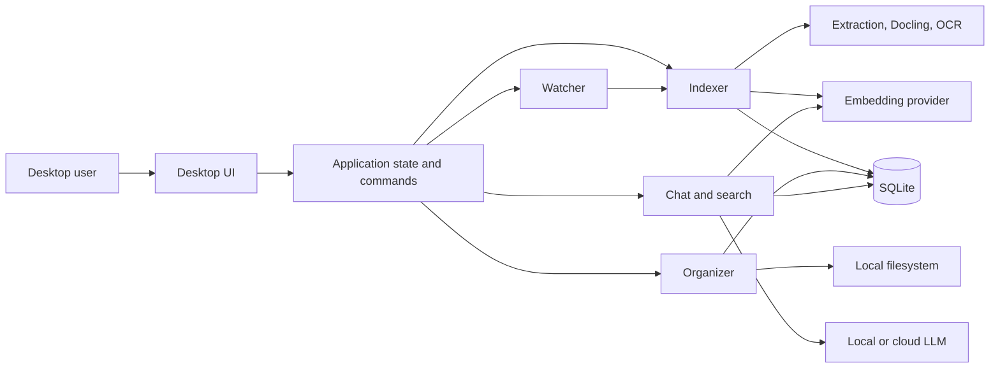
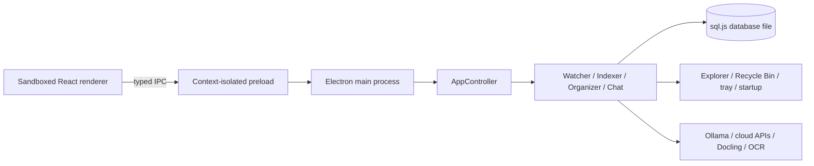
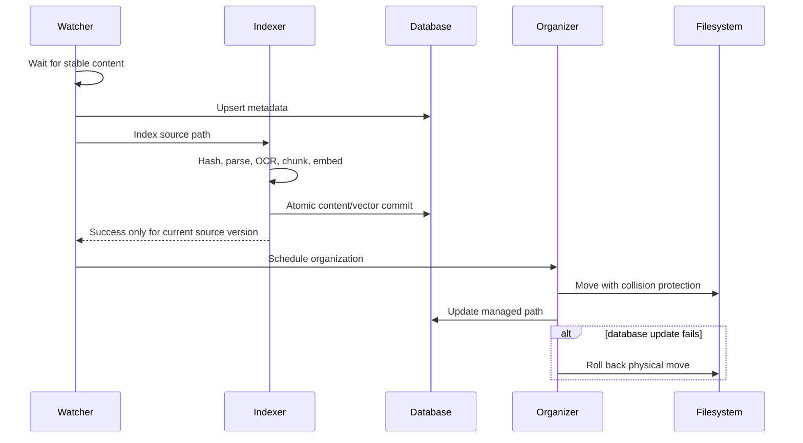

# Technical Architecture

## Runtime structure



## macOS modules

| Layer | Modules | Responsibility |
| --- | --- | --- |
| Application | `FileNestApp`, `AppState`, `AppSettings` | scenes, commands, state, settings, dependency composition |
| UI | `MainView`, `LibraryView`, `ChatView`, `FilePreviewView`, `SettingsView`, `StatisticsView`, `MenuBarView`, `OnboardingView`, `RulesView` | user journeys and native interactions |
| Domain | models, protocols, eligibility and organization policies | portable vocabulary and invariants |
| Services | watcher, indexer, organizer, chat, summaries, model managers, logs, updates | workflow coordination |
| Extraction | native extractors, Docling, OCR processor | content and structured chunks |
| Providers | embedding, LLM, OCR | local/cloud transport adapters |
| Storage | `SQLiteStore`, `AccelerateVectorStore` | durable metadata, chunks, vectors, sessions, usage |

## Windows processes



The renderer has no Node.js access. File previews use an allowlisted custom protocol whose path must already exist in the library database. External navigation is denied or routed to the system browser.

## Important flows

### Long-running UI work

`ChatView` remains mounted inside the main window while Library is selected. Visibility and hit testing change, but the streaming task and composer state stay alive. `AppState` tracks running and completed session identifiers so sidebar rows can show a spinner or unread completion dot without persisting transient UI state. Menu bar index animation uses `TimelineView`, keeping display-only animation frames out of application state.

### Watch, index, then organize



### Retrieval and chat

The query planner combines explicit metadata intent, relative/absolute date intent, direct filename/title/note/path matches, keyword content matches, and semantic chunk matches. Evidence is normalized into a confidence score before UI sorting. Normal library search is automatic and debounced; Smart Search is an explicit escalation from completed normal results and streams a short interpreted intent while the AI plan is built. File chat bypasses library retrieval. Context planning keeps recent turns, compresses older turns, and bounds retrieval to the selected model context window.

On Windows, `LibrarySearchService` owns renderer-independent lexical, date, semantic, sorting, and paging behavior. The renderer calls it through the typed preload contract instead of filtering a snapshot locally.

## Configuration and secrets

- Settings persist in SQLite as key/value data.
- macOS uses the local settings store and provider-specific configuration.
- Windows encrypts chat, embedding, and OCR API keys using Electron `safeStorage` when encryption is available.
- No authentication or multi-user boundary exists; OS user access is the security boundary.

## Build and test

### macOS

```bash
xcodebuild -project FileNest.xcodeproj -scheme FileNest -configuration Debug -destination 'platform=macOS' test
```

`script/build_and_run.sh` builds `Release` by default, preserves a stable Apple Development designated requirement, installs one canonical bundle under `~/Applications`, and verifies launch. Debug mode selects the Debug configuration unless `FILENEST_CONFIGURATION` is explicitly set.

### Windows

```bash
cd FileNestWindows
npm ci
npm run typecheck
npm test
npm run build
npm run package:win
```

## Deployment assumptions

- macOS updates require a valid HTTPS Sparkle appcast and publisher signing.
- Windows updates require a valid HTTPS generic feed, `latest.yml`, signed artifacts, and Authenticode for production trust.
- x64 and ARM64 Windows packages are configured; actual runtime validation must occur on Windows hardware or CI runners.
