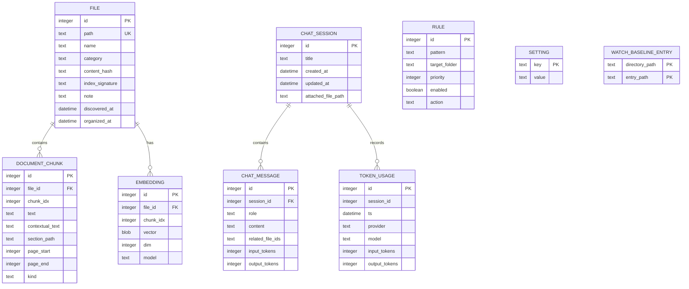

# Entity Relationship Diagram

`related_file_ids` is a logical many-to-many relationship stored as JSON, so it is intentionally not drawn as a foreign-key relationship. Rules, settings, and watch baseline entries have no entity foreign key.
