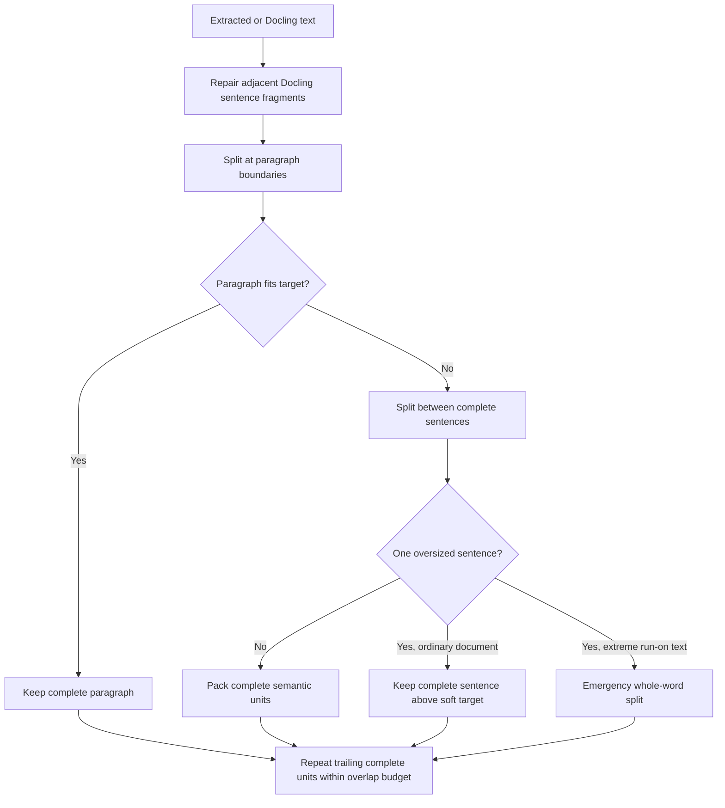
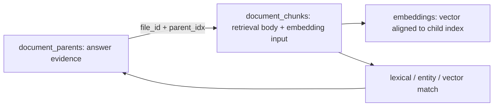

# Semantic Chunking and Reindexing

## Purpose

FileNest separates the text used for retrieval from the larger evidence supplied to the answer model. The split improves recall while preserving enough surrounding material for a grounded answer. Chunk size is therefore a semantic target, not a character-count operation.

## Terminology

| Term | Stored field | Meaning |
| --- | --- | --- |
| Parent body | `document_parents.text` | Larger section retained as answer-time evidence |
| Retrieval body | `document_chunks.text` | Smaller unit ranked by lexical, entity, and vector retrieval |
| Added embedding context | prefix of `document_chunks.contextual_text` | Section or document context prepended to the retrieval body before embedding |
| Embedding input | `document_chunks.contextual_text` | Added embedding context plus the retrieval body |
| Parent context | parent body resolved by `(file_id, parent_idx)` | Material returned after a retrieval child matches |
| Semantic overlap | repeated complete units in adjacent retrieval bodies | Recall aid applied once at the retrieval-child layer |

The retrieval body is not the same as its context. The body is the unique content being searched. Added embedding context helps the vector represent its section. Parent context is larger evidence used only after a match. The chunk preview presents these parts separately instead of showing the full embedding input as if it were overlap.

## Defaults and constraints

| Setting | Default | Allowed range | Behavior |
| --- | ---: | ---: | --- |
| Parent chunk maximum | 600 tokens | 600–1,000 | Soft maximum for source/parent construction |
| Retrieval chunk target | 300 tokens | 120–parent maximum | Soft target for searchable children |
| Maximum semantic overlap | 80 tokens | 0–(retrieval target - 1) | Maximum budget for repeated whole semantic units |

The persisted key `vectorChunkWords` is retained for compatibility, but its value is interpreted as tokens through the canonical token counter. For capacity planning, the UI uses the industry estimate that one token is approximately 0.75 English words or 1.5 Chinese characters. Exact boundaries depend on the configured tokenizer profile.

## Boundary algorithm

The rules are applied in descending semantic strength:

1. Keep a paragraph intact when it fits.
2. Split an oversized paragraph only between complete sentences.
3. Keep an ordinary oversized single sentence intact rather than cutting it to satisfy a soft target.
4. For extreme generated run-on text, split on whitespace-delimited lexical units. Text without whitespace falls back to Swift `Character` boundaries, preserving composed graphemes even when no language-specific word boundary is available.
5. Build overlap from trailing complete semantic units. If a unit does not fit the overlap budget, omit it instead of slicing it.

Source parents are created with zero overlap. Retrieval children are then derived with the configured overlap, preventing duplicated overlap from being applied at both layers. Tables use row boundaries and repeat the header row in each child.

## Docling fragment repair

Structured extraction can occasionally return two adjacent text blocks that are actually one sentence. FileNest merges them before chunking when all of these conditions hold:

- both blocks are text;
- section paths match;
- page ranges are equal or adjacent;
- the first block lacks terminal sentence punctuation; and
- the second block starts with a lowercase character.

This is intentionally conservative. It repairs strong sentence-continuation signals without merging unrelated headings, lists, tables, or distant pages.

## Embedding failure recovery

Embedding providers are called in their supported batch size. A failed batch is recursively retried as smaller batches. If a single Ollama segment fails with a runner `EOF`, FileNest halves that segment and retries, up to six split levels.

The split prefers paragraph boundaries, then sentence boundaries, then whitespace-delimited lexical boundaries. Text without any such boundary uses composed-character boundaries as the final fallback. Both halves keep the original section, page, kind, parent index, parent body, and entity metadata.

## Persistence lifecycle

The `document_parents` table is populated from legacy chunks only when the table is first introduced. Every later database initialization deletes a parent row when no `document_chunks` row references the same `(file_id, parent_idx)`. This makes replacement idempotent and prevents historical orphan rows from inflating the database or WAL.

## Signatures and rebuild policy

FileNest separates vector compatibility from content-processing preferences.

| Change | Signature category | Automatic rebuild | User choice |
| --- | --- | --- | --- |
| Embedding provider type or embedding model | Embedding space | Yes | The vector space cannot safely mix old and new vectors |
| Parent target, retrieval target, or overlap | Semantic chunking | No | Reindex now or skip; latest settings apply to new files |
| Docling enabled/version | Document parsing | No | Reindex now or skip |
| OCR provider/model/runtime | OCR | No | Reindex now or skip |
| Vectorized extensions or automatic vectorization scope | Indexing scope | No | Reindex now or skip |
| Embedding/OCR service endpoint | Service endpoint | No | Reindex now or skip |

The file-level `index_signature` stores only the embedding-space signature. Content-processing category signatures are tracked separately. The semantic chunk category is versioned as `chunking-v6-semantic-boundaries` and includes all three chunk settings.

Changing any chunk setting changes the embedding input for files that are rebuilt, but it does not make the existing vector space mathematically incompatible. FileNest therefore keeps the current index available and asks the user whether to rebuild.

## Manual reindex flow

Clicking Reindex opens a two-step confirmation sheet:

1. Select the RAG stages to reset and optionally include unindexed files. The default selects only work required by an embedding-space change; advanced stages remain opt-in.
2. Review the effective downstream dependency expansion, then confirm the destructive operation.

Selecting an upstream stage automatically selects persisted downstream stages. Structured chunking therefore includes embeddings and the retrieval index. Parsing/OCR additionally rereads managed source files. The full-pipeline option reparses sources, rebuilds chunks and vectors, recreates the retrieval index, and restarts the local reranker where available.

## Verification evidence

Automated coverage verifies:

- complete paragraph retention;
- sentence-only splitting for oversized paragraphs;
- whole-sentence preservation for ordinary oversized sentences;
- whole-word emergency splitting and semantic overlap;
- parent retention and contextual-prefix propagation in retrieval children;
- repeated table headers;
- Docling sentence-fragment repair;
- runner EOF segment splitting;
- signature and reindex selection behavior; and
- startup cleanup of unreferenced parent rows.

Primary evidence is in `FileNest/Services/IndexerService.swift`, `FileNest/App/AppSettings.swift`, `FileNest/App/AppState.swift`, `FileNest/Storage/SQLiteStore.swift`, and their corresponding tests under `FileNestTests/`.

The Windows equivalent is implemented in `FileNestWindows/src/main/indexer.ts`, `database.ts`, `chat.ts`, `library-search.ts`, `reranker.ts`, and `reranker-manager.ts`. Its parity suite verifies the same parent/child persistence contract, semantic settings limits, entity lane, fusion, reranking contract, retrieval traces, and stable evidence IDs. Native Windows runtime acceptance for the managed Python environment remains part of the Windows release gate.
